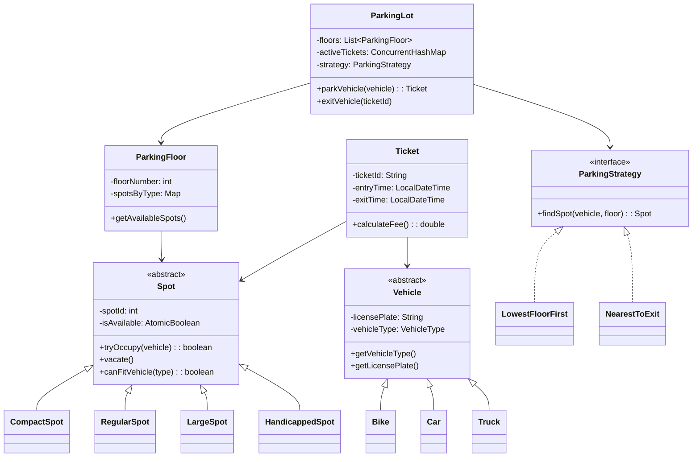

# 🚗 Parking Lot — Low Level Design (Interview Revision Guide)

> **Target Level**: SDE2 / SDE3 | **Time**: ~45 minutes  
> **Patterns**: Strategy, Singleton, Factory | **Key Topics**: SOLID, Concurrency, Scalability

---

## 📋 Phase 1: Requirements Gathering (3–5 min)

### Functional Requirements

| # | Requirement | Notes |
|---|-------------|-------|
| 1 | Check slot availability across all floors | Real-time availability |
| 2 | Vehicle types: Bike, Car, Truck | Size-based categorization |
| 3 | Slot types by size: Compact, Regular, Large | Must match vehicle size |
| 4 | Slot features: Electric, Disabled, Regular | Feature ≠ Size — separate concerns |
| 5 | Assign slot + generate ticket **atomically** | Critical for correctness |
| 6 | At **exit gate**: calculate payment based on vehicle type & duration | Multiple exit gates supported |
| 7 | Mark slot vacant only after successful payment | Ensure payment → release ordering |

### Error Handling / Edge Cases

| # | Edge Case | How to Handle |
|---|-----------|---------------|
| 1 | No slots available | Return error message |
| 2 | Slot assignment + ticket creation must be atomic | Prevent partial state |
| 3 | EV fallback: if no EV slots, park in regular slot | Two-pass approach in strategy |
| 4 | Two cars, two entry gates, one slot left | Concurrency control (CAS / locks) |
| 5 | Payment failure | Retry, don't release slot until paid |

### Out of Scope
- Payment gateway internals — use an interface (`PaymentGateway`)
- Entry/exit gate hardware integration
- Real-time display boards

---

## 🎤 Clarifying Questions to Ask the Interviewer

> These show structured thinking. Ask 3–4 of these before designing.

1. **"Should we support multiple floors?"** → Yes, multi-floor with different slot types per floor.
2. **"Can there be multiple entry/exit gates?"** → Yes, multiple gates → concurrency matters.
3. **"Does payment happen at entry or exit?"** → Exit.
4. **"Should EV slots have charging capability? Can EVs park in regular spots?"** → Yes, EV is a slot *feature*, not a vehicle type. EVs can fall back to regular spots.
5. **"What parking strategy — nearest to entry, lowest floor, or random?"** → Candidate chooses and justifies.
6. **"Do we need real-time slot count displays?"** → Out of scope for now.
7. **"Should we support reservations / pre-booking?"** → Out of scope.

---

## 🏗️ Phase 2: Core Entities (5 min)

### Entity Identification

| Entity | Type | Responsibility |
|--------|------|---------------|
| `Vehicle` | Abstract Class | Stores vehicle data (license plate, type) |
| `Slot` (Spot) | Abstract Class | Manages slot state (occupy/vacate) |
| `Floor` | Class | Groups slots per floor |
| `Ticket` | Class | Records entry/exit time, vehicle, slot |
| `TicketService` | Class | Generates tickets, calculates fees |
| `ParkingLot` | Class (Singleton) | **Orchestrator** — coordinates all operations |
| `ParkingStrategy` | Interface | Defines slot assignment algorithm |
| `PaymentGateway` | Interface | Abstracts payment processing |

### Enums

```java
enum VehicleType { BIKE, CAR, TRUCK }
enum SpotType { COMPACT, REGULAR, LARGE, HANDICAPPED }
enum SlotFeature { ELECTRIC, DISABLED, REGULAR }
enum TicketStatus { ACTIVE, PAID }
```

### Relationships



---

## 🔷 Phase 3: SOLID Principles (Know where each applies)

### S — Single Responsibility Principle

| Class | Single Responsibility |
|-------|----------------------|
| `Vehicle` | Holds vehicle data only |
| `Spot` | Manages its own occupied/vacant state |
| `Ticket` | Records parking session data |
| `TicketService` | Generates tickets, calculates fees |
| `ParkingLot` | Orchestrates parking operations |
| `ParkingStrategy` | Decides which slot to assign |

> **Cross-question**: *"Why not put `generateTicket()` inside the `Ticket` class?"*  
> **Answer**: That violates SRP. A `Ticket` shouldn't create itself — that's the `TicketService`'s job. `Ticket` is a data holder; `TicketService` handles the lifecycle.

### O — Open/Closed Principle

```java
// Adding a new vehicle type — NO modification to existing code
class ElectricCar extends Car {
    private boolean needsCharging;
    public ElectricCar(String plate, boolean handicapped, boolean needsCharging) {
        super(plate, handicapped);
        this.needsCharging = needsCharging;
    }
}

// Adding a new strategy — NO modification to ParkingLot
class NearestToExitStrategy implements ParkingStrategy { ... }
```

### L — Liskov Substitution Principle

```java
Vehicle v = new Car("ABC-123", false);
lot.parkVehicle(v);  // Works with any Vehicle subclass — Bike, Car, Truck
```

Any subclass of `Vehicle` can be used wherever `Vehicle` is expected without breaking behavior.

### I — Interface Segregation Principle

```java
// Small, focused interfaces — clients only depend on what they need
interface ParkingStrategy {
    Spot findSpot(Vehicle vehicle, ParkingFloor floor);
}

interface PaymentGateway {
    boolean processPayment(double amount);
}

interface TicketService {
    Ticket generateTicket(Vehicle vehicle, Spot spot);
    double calculateFee(Ticket ticket);
}
```

> **Cross-question**: *"Why not a single `ParkingService` interface with all methods?"*  
> **Answer**: ISP violation. A strategy implementation shouldn't be forced to implement `processPayment()`. Keep interfaces cohesive.

### D — Dependency Inversion Principle

```java
class ParkingLot {
    private ParkingStrategy strategy;  // Depends on abstraction, NOT LowestFloorFirst
    private PaymentGateway paymentGateway;  // Depends on interface, NOT RazorpayGateway
    
    // Inject via constructor or setter
    public void setStrategy(ParkingStrategy strategy) {
        this.strategy = strategy;
    }
}
```

> **Cross-question**: *"Why inject strategy instead of hardcoding?"*  
> **Answer**: DIP + testability. In tests, inject a mock strategy. In production, inject the real one. The `ParkingLot` doesn't care which strategy — it just calls `findSpot()`.

---

## 🎨 Design Patterns Used

| Pattern | Where | Why | Cross-Question |
|---------|-------|-----|---------------|
| **Strategy** | `ParkingStrategy` interface with `LowestFloorFirst`, `NearestToExit` | Swap parking algorithms without modifying `ParkingLot` | *"What if we want to change strategy at runtime?"* → Just call `setStrategy()` |
| **Singleton** | `ParkingLot` | Only one parking lot instance should exist | *"How do you make it thread-safe?"* → Double-checked locking with `volatile` |
| **Factory** | `TicketService.generateTicket()` | Encapsulates ticket creation logic | *"Why not `new Ticket()` directly?"* → Factory handles ID generation, timestamps, validation |
| **Template Method** | `Spot.canFitVehicle()` | Each spot subclass defines its own vehicle-fitting rules | *"Why abstract method?"* → Enforces contract, each spot type has different rules |

---

## ⚡ Phase 4: Concurrency (Critical for SDE2/3)

### The Problem: TOCTOU Race Condition

```
Thread 1 (Gate A)                    Thread 2 (Gate B)
──────────────────                   ──────────────────
isAvailable(slot5)? → true ✓         isAvailable(slot5)? → true ✓
                                     
occupy(slot5, bikeA)                 occupy(slot5, bikeB)  ← 💥 CONFLICT!
```

Both threads **checked** availability at time T1, but **used** the slot at time T2. Between check and use, the other thread also checked.

### Solution: Three Levels of Concurrency Control

#### Level 1: `AtomicBoolean` + CAS on Slot (Best — Lock-Free) ⭐

```java
class Spot {
    private AtomicBoolean available = new AtomicBoolean(true);
    
    public boolean tryOccupy(Vehicle vehicle) {
        if (available.compareAndSet(true, false)) {  // Atomic check-and-set
            this.parkedVehicle = vehicle;
            return true;   // I got it!
        }
        return false;      // Someone else got it — move to next slot
    }
}
```

- **No locks, no blocking** — threads never wait
- If CAS fails, strategy moves to next slot
- Best throughput for high-concurrency parking lots

#### Level 2: `synchronized` per Slot

```java
public boolean tryOccupy(Vehicle vehicle) {
    synchronized (this) {
        if (!isAvailable) return false;
        this.isAvailable = false;
        this.parkedVehicle = vehicle;
        return true;
    }
}
```

- Simple, correct
- Slight overhead from monitor lock, but fine for most cases

#### Level 3: `ReentrantLock` on ParkingLot (Coarse-grained)

```java
private final ReentrantLock parkingLock = new ReentrantLock();

public Ticket parkVehicle(Vehicle vehicle) {
    parkingLock.lock();
    try {
        // ... find spot, occupy, generate ticket
    } finally {
        parkingLock.unlock();  // Always release in finally
    }
}
```

- Simplest but **bottleneck** — only one car parks at a time
- Fine for small lots, bad for 50 floors × 200 slots

### Thread-Safe Data Structures

| Data Structure | What It Replaces | Why |
|---|---|---|
| `ConcurrentHashMap` | `HashMap` for `activeTickets` | Multiple exit gates can call `exitVehicle()` concurrently |
| `AtomicInteger` | `int ticketCounter` | Thread-safe ticket ID generation |
| `CopyOnWriteArrayList` | `ArrayList` for floors | Rarely modified, frequently read |

### Minimal Critical Section (Optimize Lock Scope)

```java
parkVehicle(vehicle):
    ┌─── MUST be atomic ──────────────────┐
    │ Slot slot = strategy.findSpot(...)   │  // Reading shared state
    │ slot.tryOccupy(vehicle)              │  // Mutating shared state
    └─────────────────────────────────────┘
    
    Ticket ticket = new Ticket(...)        // Local object — no lock needed
    activeTickets.put(id, ticket)          // ConcurrentHashMap — no lock needed
```

> **Cross-question**: *"With AtomicBoolean, is there a deadlock risk?"*  
> **Answer**: No. Deadlock requires **hold-and-wait** — a thread holds one lock while waiting for another. With CAS on individual slots, there's no lock held, so deadlock is impossible.

> **Cross-question**: *"What about livelock with CAS?"*  
> **Answer**: Theoretically possible if threads keep retrying on the same slot. But since we iterate to the **next** slot on failure, livelock is avoided.

---

## 📈 Scalability Optimization

### Problem: Linear Scan is O(Floors × Slots)

Current `assignSlot()` scans every slot on every floor. For 50 floors × 200 slots = **10,000 iterations worst case**.

### Solution: Composed Data Structure — O(1) Assignment

```java
Map<VehicleType, TreeMap<Integer, Queue<Slot>>> availableSlots;
//       │                  │           │
//  O(1) lookup      Floor number   Ready-to-assign
//                   (sorted)       slots on that floor
```

**Lookup flow:**
```
availableSlots.get(CAR)          → O(1) — get all car slots
    .firstEntry()                → O(1) — get lowest floor (TreeMap sorted)
    .getValue().poll()           → O(1) — grab first available slot
```

**Release flow:**
```
availableSlots.get(CAR)
    .get(floorNumber)
    .add(slot)                   → O(1) — return slot to queue
```

**Total: O(1) for both park and unpark.** 🚀

> **Cross-question**: *"What if we want 'nearest to exit' strategy? Does this structure still work?"*  
> **Answer**: You'd need a different key for the TreeMap — maybe distance-to-exit instead of floor number. The **pattern** (Map + sorted structure + queue) stays the same, but the ordering changes. That's the beauty of the Strategy pattern — the data structure is an implementation detail of each strategy.

---

## 🔌 EV Fallback Logic

### Two-Pass Approach

```java
public Spot findSpot(Vehicle vehicle, ParkingFloor floor) {
    SlotFeature preferredFeature = vehicle.getPreferredFeature();  // ELECTRIC for EVs
    
    // Pass 1: Try preferred feature (EV slot with charger)
    for (Spot spot : floor.getSlotsByTypeAndFeature(vehicleType, preferredFeature)) {
        if (spot.isAvailable()) return spot;
    }
    
    // Pass 2: Fallback to regular slots (no charger, but correct size)
    for (Spot spot : floor.getSlotsByType(vehicleType)) {
        if (spot.isAvailable() && spot.getFeature() == SlotFeature.REGULAR) {
            return spot;
        }
    }
    
    return null;  // No slot available
}
```

> **Key insight**: Feature (ELECTRIC) is a **preference**, not a hard requirement. Size (COMPACT/REGULAR/LARGE) IS a hard requirement — a Truck can never park in a Compact slot.

---

## 💻 Complete Production Code

```java
import java.util.*;
import java.util.concurrent.*;
import java.util.concurrent.atomic.*;
import java.time.LocalDateTime;
import java.time.Duration;

// ==================== ENUMS ====================

enum VehicleType {
    BIKE, CAR, TRUCK
}

enum SpotType {
    COMPACT,        // For bikes
    REGULAR,        // For cars
    LARGE,          // For trucks
    HANDICAPPED     // Priority spots — any size
}

enum SlotFeature {
    REGULAR, ELECTRIC, DISABLED
}

enum TicketStatus {
    ACTIVE, PAID
}

// ==================== INTERFACES (ISP + DIP) ====================

interface ParkingStrategy {
    Spot findSpot(Vehicle vehicle, ParkingFloor floor);
}

interface PaymentGateway {
    boolean processPayment(double amount);
}

// ==================== VEHICLE (SRP + LSP + OCP) ====================

abstract class Vehicle {
    private String licensePlate;
    private VehicleType vehicleType;
    private boolean isHandicapped;

    public Vehicle(String licensePlate, VehicleType vehicleType, boolean isHandicapped) {
        this.licensePlate = licensePlate;
        this.vehicleType = vehicleType;
        this.isHandicapped = isHandicapped;
    }

    public VehicleType getVehicleType() { return vehicleType; }
    public String getLicensePlate() { return licensePlate; }
    public boolean isHandicapped() { return isHandicapped; }
}

class Bike extends Vehicle {
    public Bike(String licensePlate, boolean isHandicapped) {
        super(licensePlate, VehicleType.BIKE, isHandicapped);
    }
}

class Car extends Vehicle {
    public Car(String licensePlate, boolean isHandicapped) {
        super(licensePlate, VehicleType.CAR, isHandicapped);
    }
}

class Truck extends Vehicle {
    public Truck(String licensePlate, boolean isHandicapped) {
        super(licensePlate, VehicleType.TRUCK, isHandicapped);
    }
}

// ==================== SPOT (SRP + OCP + Template Method) ====================

abstract class Spot {
    private int spotId;
    private SpotType spotType;
    private SlotFeature feature;
    private AtomicBoolean available = new AtomicBoolean(true);  // Lock-free concurrency
    private volatile Vehicle parkedVehicle;  // volatile for visibility

    public Spot(int spotId, SpotType spotType, SlotFeature feature) {
        this.spotId = spotId;
        this.spotType = spotType;
        this.feature = feature;
    }

    public int getSpotId() { return spotId; }
    public SpotType getSpotType() { return spotType; }
    public SlotFeature getFeature() { return feature; }
    public boolean isAvailable() { return available.get(); }
    public Vehicle getParkedVehicle() { return parkedVehicle; }

    /**
     * Atomic slot claiming using CAS — prevents TOCTOU race condition.
     * If two threads call this simultaneously, exactly ONE will succeed.
     */
    public boolean tryOccupy(Vehicle vehicle) {
        if (available.compareAndSet(true, false)) {
            this.parkedVehicle = vehicle;
            return true;
        }
        return false;  // Another thread claimed it first
    }

    public void vacate() {
        this.parkedVehicle = null;
        available.set(true);
    }

    // Template Method — each spot subclass defines what vehicles it can fit
    public abstract boolean canFitVehicle(VehicleType vehicleType);
}

class CompactSpot extends Spot {
    public CompactSpot(int spotId) { super(spotId, SpotType.COMPACT, SlotFeature.REGULAR); }
    public CompactSpot(int spotId, SlotFeature feature) { super(spotId, SpotType.COMPACT, feature); }

    @Override
    public boolean canFitVehicle(VehicleType vehicleType) {
        return vehicleType == VehicleType.BIKE;
    }
}

class RegularSpot extends Spot {
    public RegularSpot(int spotId) { super(spotId, SpotType.REGULAR, SlotFeature.REGULAR); }
    public RegularSpot(int spotId, SlotFeature feature) { super(spotId, SpotType.REGULAR, feature); }

    @Override
    public boolean canFitVehicle(VehicleType vehicleType) {
        return vehicleType == VehicleType.BIKE || vehicleType == VehicleType.CAR;
    }
}

class LargeSpot extends Spot {
    public LargeSpot(int spotId) { super(spotId, SpotType.LARGE, SlotFeature.REGULAR); }
    public LargeSpot(int spotId, SlotFeature feature) { super(spotId, SpotType.LARGE, feature); }

    @Override
    public boolean canFitVehicle(VehicleType vehicleType) {
        return true;  // Large spots can fit any vehicle
    }
}

class HandicappedSpot extends Spot {
    public HandicappedSpot(int spotId) { super(spotId, SpotType.HANDICAPPED, SlotFeature.REGULAR); }

    @Override
    public boolean canFitVehicle(VehicleType vehicleType) {
        return true;  // Handicapped spots can fit any vehicle
    }
}

// ==================== TICKET (SRP) ====================

class Ticket {
    private String ticketId;
    private Vehicle vehicle;
    private Spot spot;
    private LocalDateTime entryTime;
    private LocalDateTime exitTime;
    private TicketStatus status;
    private double fee;

    public Ticket(String ticketId, Vehicle vehicle, Spot spot) {
        this.ticketId = ticketId;
        this.vehicle = vehicle;
        this.spot = spot;
        this.entryTime = LocalDateTime.now();
        this.status = TicketStatus.ACTIVE;
    }

    public String getTicketId() { return ticketId; }
    public Vehicle getVehicle() { return vehicle; }
    public Spot getSpot() { return spot; }
    public LocalDateTime getEntryTime() { return entryTime; }
    public LocalDateTime getExitTime() { return exitTime; }
    public TicketStatus getStatus() { return status; }
    public double getFee() { return fee; }

    public void setExitTime(LocalDateTime exitTime) { this.exitTime = exitTime; }
    public void setStatus(TicketStatus status) { this.status = status; }
    public void setFee(double fee) { this.fee = fee; }
}

// ==================== TICKET SERVICE (SRP + Factory Pattern) ====================

class TicketService {
    private AtomicInteger ticketCounter = new AtomicInteger(0);  // Thread-safe counter
    private Map<VehicleType, Double> hourlyRates;

    public TicketService() {
        hourlyRates = new HashMap<>();
        hourlyRates.put(VehicleType.BIKE, 1.0);
        hourlyRates.put(VehicleType.CAR, 2.0);
        hourlyRates.put(VehicleType.TRUCK, 5.0);
    }

    public Ticket generateTicket(Vehicle vehicle, Spot spot) {
        String ticketId = "TKT-" + ticketCounter.incrementAndGet();
        return new Ticket(ticketId, vehicle, spot);
    }

    public double calculateFee(Ticket ticket) {
        ticket.setExitTime(LocalDateTime.now());
        long minutes = Duration.between(ticket.getEntryTime(), ticket.getExitTime()).toMinutes();
        long hours = Math.max(1, (minutes + 59) / 60);  // Round up, minimum 1 hour

        double rate = hourlyRates.getOrDefault(ticket.getVehicle().getVehicleType(), 2.0);
        return hours * rate;
    }

    public void processPayment(Ticket ticket) {
        double fee = calculateFee(ticket);
        ticket.setFee(fee);
        ticket.setStatus(TicketStatus.PAID);
    }
}

// ==================== PARKING FLOOR ====================

class ParkingFloor {
    private int floorNumber;
    private Map<SpotType, List<Spot>> spotsByType;

    public ParkingFloor(int floorNumber) {
        this.floorNumber = floorNumber;
        this.spotsByType = new HashMap<>();
        for (SpotType type : SpotType.values()) {
            spotsByType.put(type, new ArrayList<>());
        }
    }

    public void addSpot(Spot spot) {
        spotsByType.get(spot.getSpotType()).add(spot);
    }

    public List<Spot> getSpotsByType(SpotType spotType) {
        return spotsByType.getOrDefault(spotType, Collections.emptyList());
    }

    public int getFloorNumber() { return floorNumber; }

    public int getAvailableCount() {
        int count = 0;
        for (List<Spot> spots : spotsByType.values()) {
            for (Spot spot : spots) {
                if (spot.isAvailable()) count++;
            }
        }
        return count;
    }
}

// ==================== STRATEGY PATTERN (OCP + DIP) ====================

class LowestFloorFirstStrategy implements ParkingStrategy {

    @Override
    public Spot findSpot(Vehicle vehicle, ParkingFloor floor) {
        List<SpotType> preferred = getPreferredSpots(vehicle);

        for (SpotType spotType : preferred) {
            for (Spot spot : floor.getSpotsByType(spotType)) {
                if (spot.isAvailable() && spot.canFitVehicle(vehicle.getVehicleType())) {
                    return spot;
                }
            }
        }
        return null;
    }

    private List<SpotType> getPreferredSpots(Vehicle vehicle) {
        // Handicapped gets priority access to handicapped spots
        if (vehicle.isHandicapped()) {
            return Arrays.asList(SpotType.HANDICAPPED, SpotType.REGULAR, SpotType.LARGE);
        }
        switch (vehicle.getVehicleType()) {
            case BIKE:  return Arrays.asList(SpotType.COMPACT, SpotType.REGULAR, SpotType.LARGE);
            case CAR:   return Arrays.asList(SpotType.REGULAR, SpotType.LARGE);
            case TRUCK: return Arrays.asList(SpotType.LARGE);
            default:    return Arrays.asList(SpotType.REGULAR);
        }
    }
}

// ==================== PARKING LOT — ORCHESTRATOR (Singleton + Facade) ====================

class ParkingLot {
    // --- Singleton with Double-Checked Locking ---
    private static volatile ParkingLot instance;

    public static ParkingLot getInstance(String name) {
        if (instance == null) {
            synchronized (ParkingLot.class) {
                if (instance == null) {
                    instance = new ParkingLot(name);
                }
            }
        }
        return instance;
    }

    // --- Fields ---
    private String name;
    private List<ParkingFloor> floors;
    private ConcurrentHashMap<String, Ticket> activeTickets;   // Thread-safe
    private TicketService ticketService;
    private ParkingStrategy strategy;

    private ParkingLot(String name) {
        this.name = name;
        this.floors = new CopyOnWriteArrayList<>();
        this.activeTickets = new ConcurrentHashMap<>();
        this.ticketService = new TicketService();
        this.strategy = new LowestFloorFirstStrategy();
    }

    // DIP — inject strategy at runtime
    public void setStrategy(ParkingStrategy strategy) {
        this.strategy = strategy;
    }

    public void addFloor(ParkingFloor floor) {
        floors.add(floor);
    }

    // ========== PARK VEHICLE ==========
    public Ticket parkVehicle(Vehicle vehicle) {
        // Iterate floors lowest-first (floors list is ordered)
        for (ParkingFloor floor : floors) {
            Spot spot = strategy.findSpot(vehicle, floor);
            if (spot != null) {
                // Atomic claim — CAS ensures only one thread succeeds
                if (spot.tryOccupy(vehicle)) {
                    Ticket ticket = ticketService.generateTicket(vehicle, spot);
                    activeTickets.put(ticket.getTicketId(), ticket);
                    return ticket;
                }
                // If tryOccupy fails, another thread got it — keep scanning
            }
        }
        System.out.println("No parking spot available for " + vehicle.getVehicleType());
        return null;
    }

    // ========== EXIT VEHICLE ==========
    public void exitVehicle(String ticketId) {
        Ticket ticket = activeTickets.get(ticketId);
        if (ticket == null) {
            System.out.println("Invalid ticket ID: " + ticketId);
            return;
        }

        // Calculate & process payment
        ticketService.processPayment(ticket);

        // Release the spot
        ticket.getSpot().vacate();

        // Remove from active tickets
        activeTickets.remove(ticketId);

        System.out.println("Vehicle " + ticket.getVehicle().getLicensePlate()
            + " exited. Fee: $" + ticket.getFee());
    }

    // ========== DISPLAY ==========
    public void displayAvailability() {
        System.out.println("\n===== " + name + " =====");
        for (ParkingFloor floor : floors) {
            System.out.println("Floor " + floor.getFloorNumber()
                + ": " + floor.getAvailableCount() + " spots available");
        }
    }
}
```

---

## 📊 Complexity Analysis

| Operation | Current (Linear Scan) | Optimized (TreeMap + Queue) |
|-----------|----------------------|----------------------------|
| Park Vehicle | O(F × S) | O(1) |
| Exit Vehicle | O(1) via ticketId lookup | O(1) |
| Check Availability | O(F × S) | O(1) with counters |

*F = floors, S = spots per floor*

---

## ❓ Interview Cross-Questions & Answers

### Design Questions

> **Q: Why Singleton for ParkingLot?**  
> A: There's only one physical parking lot. Singleton ensures a single source of truth. Made thread-safe with double-checked locking + `volatile`.

> **Q: Why abstract class for Vehicle instead of just using VehicleType enum?**  
> A: Extensibility. If we need `ElectricCar extends Car` with charging preferences, we can add it without modifying existing code (OCP). An enum can't be extended.

> **Q: Why Strategy pattern and not just if-else in ParkingLot?**  
> A: (1) OCP — new strategies without modifying ParkingLot. (2) Runtime swapping — peak hours might use a different strategy. (3) Testability — inject mock strategy in tests.

> **Q: Why is `canFitVehicle()` an abstract method (Template Method)?**  
> A: Each spot type has different rules. CompactSpot only fits BIKE. RegularSpot fits BIKE + CAR. Making it abstract **enforces** that every new spot type MUST define its rules — compile-time safety.

> **Q: Should Ticket generate itself or should a service create it?**  
> A: Service creates it (SRP). Ticket is a data object. TicketService handles ID generation, timestamps, and fee calculation. A Ticket shouldn't know how to create itself.

### Concurrency Questions

> **Q: What is a TOCTOU bug?**  
> A: Time-of-Check to Time-of-Use. Thread checks `isAvailable() == true`, but before it calls `occupy()`, another thread already took the slot. The check and use must be **atomic**.

> **Q: Why `AtomicBoolean.compareAndSet()` over `synchronized`?**  
> A: CAS is a single CPU instruction — no context switching, no lock contention, no deadlock risk. `synchronized` acquires a monitor lock which has overhead. For a simple boolean flip, CAS is ideal.

> **Q: Can deadlock occur in this design?**  
> A: No. Deadlock requires hold-and-wait + circular dependency. With CAS on slots, no lock is ever held. With `ConcurrentHashMap`, internal locking is fine-grained and doesn't create cycles.

> **Q: What if `compareAndSet` keeps failing (livelock)?**  
> A: The strategy iterates to the **next** slot, so it never retries the same slot. This eliminates livelock.

> **Q: Why `volatile` on `parkedVehicle` field?**  
> A: Ensures visibility. Without `volatile`, Thread A might update `parkedVehicle`, but Thread B might read a stale cached value from its CPU cache. `volatile` forces a read from main memory.

### Scalability Questions

> **Q: How would you handle 50 floors × 200 slots?**  
> A: Use `Map<VehicleType, TreeMap<Integer, Queue<Slot>>>` for O(1) slot assignment instead of linear scan. The TreeMap keeps floors sorted, the Queue gives instant slot retrieval.

> **Q: How would you scale to multiple parking lots across a city?**  
> A: (1) Remove Singleton — each lot is an instance. (2) Add a `ParkingLotManager` service that routes vehicles to the nearest lot with availability. (3) Use a database instead of in-memory maps for persistence.

> **Q: How would you add support for reservations?**  
> A: (1) Add `ReservationStatus` to Spot (AVAILABLE, RESERVED, OCCUPIED). (2) `reserveSpot()` method with a TTL — if vehicle doesn't arrive in 15 minutes, spot is released. (3) Use `ScheduledExecutorService` for auto-release.

### Edge Case Questions

> **Q: What if payment fails?**  
> A: Don't release the slot. Return a payment failure response. The vehicle stays parked. The user retries payment. Only after successful payment → vacate slot → remove ticket.

> **Q: What if the system crashes mid-parking?**  
> A: This is where persistence matters. In production, you'd use a database transaction: BEGIN → assign slot + create ticket → COMMIT. If crash occurs mid-way, the transaction rolls back automatically.

> **Q: Can a vehicle park twice without exiting?**  
> A: Add a check in `parkVehicle()` — look up `licensePlate` in active tickets. If found, reject with "Vehicle already parked."

---

## ✅ Interview Checklist

- [x] Clarify requirements (3-5 min)
- [x] Identify core entities — nouns → classes, verbs → methods (5 min)
- [x] Draw class diagram / relationships
- [x] Apply SOLID principles — mention where each applies
- [x] Identify design patterns — Strategy, Singleton, Factory, Template Method
- [x] Implement `parkVehicle()` and `exitVehicle()` (15-25 min)
- [x] Discuss concurrency — TOCTOU, CAS, lock granularity
- [x] Discuss scalability — data structure optimization
- [x] Discuss trade-offs (5 min)
- [x] Handle edge cases — EV fallback, payment failure, no slots

---

> 💡 **Pro Tip**: Start simple, iterate. Show you can handle follow-ups. Lead with the Strategy pattern and concurrency — these are the two things that separate SDE2 from SDE3.
